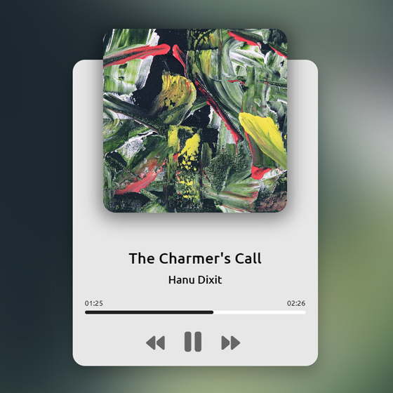

# Day #30

### Music Player App
In this tutorial ([Open in Github](https://github.com/Maitomanito)),  I am gonna showing to you how to code a music player in javascript. we create a project that you can play audio files with javascript from local folder or any url❗️

# Screenshot
Here we have project screenshot :

